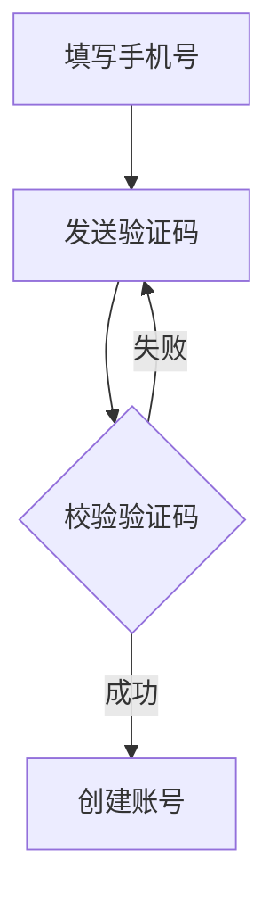

下面这套方案可以直接作为参赛项目的设计稿来推进，主线是：**基于 Excalidraw 二开，做一个“只能用语音操作的 AI 绘图工具”**，项目名字可以叫 **VoiceDraw / 语绘 / SayDraw**。

---

# 一、项目定位

这个项目不是做“AI 生成图片”，而是做一个 **语音控制的矢量绘图工具**。

用户打开网页后，不用鼠标和键盘，只要说话，就能完成画图、改图、排版、删除、撤销、生成流程图等操作。

比如用户说：

> 画一个登录流程图，从输入账号密码开始，接着校验信息，成功后进入首页，失败后提示重新输入

系统要把这句话拆成多个节点和箭头，然后自动画到画布上。

这个方向比“语音生成图片”更适合比赛，因为它能展示 **指令理解、复杂指令拆解、画布操作、错误纠正、成本控制** 这些能力。

---

# 二、推荐开源项目选择

## 主项目：Excalidraw

建议以 **Excalidraw** 为基础二开，不建议从零写画布。

Excalidraw 本身就是开源白板工具，支持矩形、圆形、菱形、箭头、线条、自由绘制、橡皮擦、缩放、撤销重做、导出 PNG/SVG/剪贴板，还能把图保存成 `.excalidraw` JSON 文件，方便做二次开发和数据持久化，它的仓库显示为 MIT license，适合参赛项目直接复用。([GitHub][1])

它还提供 React 组件包，可以直接通过 `npm install react react-dom @excalidraw/excalidraw` 集成到自己的项目里，不需要 fork 整个 Excalidraw 仓库。([GitHub][1])

## 流程图增强：mermaid-to-excalidraw

复杂流程图不要自己手动排版，可以让 AI 先生成 Mermaid，再用 `@excalidraw/mermaid-to-excalidraw` 转成 Excalidraw 元素，这个库本来就是用来把 Mermaid 图转换成 Excalidraw 图的。([docs.excalidraw.com][2])

它的 API 能接收 Mermaid 语法，返回 Excalidraw 的元素骨架，再转成可渲染的 Excalidraw 元素。([docs.excalidraw.com][3])

## 语音识别：react-speech-recognition

前期用 `react-speech-recognition` 最快，它提供 React hook，可以直接拿到麦克风识别出来的文字；底层用的是浏览器 Web Speech API，Chrome 体验相对更好，但用户第一次使用时需要授权麦克风。([GitHub][4])

Web Speech API 的 `SpeechRecognition.lang` 可以设置识别语言，比如 `zh-CN`，`continuous` 可以控制是否连续返回识别结果。([MDN Web Docs][5])

## 备用方案：whisper.cpp

如果比赛现场网络不稳，或者浏览器语音识别效果不好，可以加一个本地语音识别备选方案，比如 `whisper.cpp`，它是 C/C++ 实现的 Whisper 推理项目，支持 CPU、GPU、量化和多种硬件加速。([GitHub][6])

不过 MVP 阶段不建议一开始就接 Whisper，先把核心链路跑通更重要。

## 不优先选 tldraw

tldraw 的 SDK 很强，适合做高度定制的无限画布应用，支持自定义形状、工具、绑定和 UI。([tldraw][7])

但它现在的 SDK 生产使用需要 trial、commercial 或 hobby license，生产环境还需要 license key，比赛项目可能能用 trial，但从“尽量复用开源、降低授权风险”的角度看，Excalidraw 更稳。([tldraw][8])

---

# 三、整体架构

推荐做成一个 Web 项目，前端为主，后端只做可选增强。

```text
用户语音
  ↓
语音识别 ASR
  ↓
文字指令
  ↓
指令预处理
  ↓
规则解析 / AI 解析
  ↓
标准绘图命令 JSON
  ↓
命令校验器
  ↓
画布操作执行器
  ↓
Excalidraw 画布更新
  ↓
文字反馈 / 语音反馈
```

核心思想是：**用户说自然语言，系统转成结构化命令，再由 Excalidraw 执行。**

不要让 AI 直接控制画布，AI 只负责“理解意图”和“生成命令”，真正改画布的逻辑要由你的代码执行，这样更稳定，也更方便写设计文档。

---

# 四、页面设计

页面分成三块：

```text
┌──────────────────────────────────────────────┐
│ 顶部：项目名 + 当前状态 + 麦克风状态          │
├───────────────┬──────────────────────────────┤
│ 左侧语音区     │ 中间 Excalidraw 画布          │
│               │                              │
│ 当前识别文本   │                              │
│ 指令解析结果   │                              │
│ 执行记录       │                              │
│ 错误提示       │                              │
│ 示例指令       │                              │
├───────────────┴──────────────────────────────┤
│ 底部：最近一次操作、撤销提示、成本统计         │
└──────────────────────────────────────────────┘
```

左侧不是普通工具栏，而是 **语音控制台**，里面显示：

当前听到的话；
系统理解成什么命令；
执行成功还是失败；
如果指令不清楚，系统要求用户补充说明；
最近 10 条操作记录；
今天调用 AI 的次数和估算成本。

中间是 Excalidraw 画布。

比赛模式下，可以打开 Excalidraw 的 `viewModeEnabled`，它表示画布处于查看模式，而且宿主应用可以控制这个状态，用户不能在 Excalidraw 内部自己切换。([docs.excalidraw.com][9])

这样可以更符合题目要求：用户不能用鼠标键盘画图，所有修改都来自语音指令。

---

# 五、功能设计

## 第一阶段：基础语音绘图

必须实现这些指令：

```text
画一个红色圆形
画一个蓝色矩形
画一个黄色菱形
在中间写“用户登录”
画一条从圆形到矩形的箭头
把刚才的矩形放大一点
把圆形移动到左边
删除刚才的箭头
撤销上一步
清空画布
```

这一阶段不用 AI 也能做，直接用规则解析即可。

比如：

```text
画一个红色圆形
```

解析成：

```json
{
  "action": "create",
  "shape": "ellipse",
  "color": "red",
  "position": "center",
  "width": 160,
  "height": 100
}
```

然后转成 Excalidraw 元素，调用画布 API 更新场景。

Excalidraw 支持通过 API 获取实例，宿主应用可以保存 `excalidrawAPI`，后续调用它的方法控制画布；它也支持 `onChange` 监听画布内容变化。([docs.excalidraw.com][10])

---

## 第二阶段：对象选择和编辑

因为不能用鼠标点选，所以要做一套 **语音选中机制**。

支持这些说法：

```text
选中刚才的圆形
选中第一个矩形
选中蓝色的节点
选中文字是“校验信息”的框
把它改成绿色
把它往右移动一点
把它放大 20%
```

系统内部要维护一个对象索引：

```json
{
  "id": "shape_001",
  "type": "rectangle",
  "text": "校验信息",
  "color": "blue",
  "createdAt": 1710000000,
  "alias": ["第一个矩形", "蓝色节点", "校验信息"]
}
```

用户说“它”“刚才那个”“蓝色节点”时，系统就能找到对应元素。

这个功能很关键，因为它能体现项目不是简单调用语音识别，而是真的在做“语音交互式绘图”。

---

## 第三阶段：复杂指令拆解

这是比赛加分点。

用户说：

```text
画一个用户注册流程图，从填写手机号开始，发送验证码，然后校验验证码，成功后创建账号，失败后重新输入验证码
```

系统不要一步一步问，而是直接拆成：

```json
[
  {
    "action": "create_flow_node",
    "text": "填写手机号",
    "shape": "rectangle"
  },
  {
    "action": "create_flow_node",
    "text": "发送验证码",
    "shape": "rectangle"
  },
  {
    "action": "create_flow_node",
    "text": "校验验证码",
    "shape": "diamond"
  },
  {
    "action": "create_flow_node",
    "text": "创建账号",
    "shape": "rectangle"
  },
  {
    "action": "create_arrow",
    "from": "填写手机号",
    "to": "发送验证码"
  }
]
```

也可以让 AI 先生成 Mermaid：



再通过 `@excalidraw/mermaid-to-excalidraw` 转成 Excalidraw 元素，最后渲染到画布上。([docs.excalidraw.com][3])

这样做的好处是：**复杂流程图交给 Mermaid 处理结构，你只负责把结果放到画布里。**

---

## 第四阶段：错误纠正和二次确认

语音识别很容易出错，所以必须设计容错机制。

比如用户说：

```text
把红色圆形删掉
```

但画布里有两个红色圆形，系统不能随便删，应该提示：

```text
找到 2 个红色圆形，请说明要删除左边的，还是右边的
```

用户继续说：

```text
删除左边的
```

系统再执行删除。

常见错误处理：

```text
没有找到对象：提示用户重新描述
找到多个对象：要求用户补充位置或文字
命令不完整：询问缺少的信息
颜色识别失败：用默认颜色，并提示用户
复杂指令解析失败：转为分步确认
```

这部分很适合写进设计文档，因为题目要求考虑指令理解准确性和容错性。

---

# 六、命令系统设计

建议把所有语音指令统一转成一种标准命令格式。

## 1. 创建图形

```json
{
  "intent": "create_shape",
  "shape": "rectangle",
  "text": "登录",
  "style": {
    "strokeColor": "#1e1e1e",
    "backgroundColor": "#dbeafe"
  },
  "layout": {
    "position": "center",
    "width": 180,
    "height": 80
  }
}
```

## 2. 编辑图形

```json
{
  "intent": "update_shape",
  "target": {
    "ref": "last",
    "type": "rectangle"
  },
  "changes": {
    "backgroundColor": "#22c55e",
    "scale": 1.2
  }
}
```

## 3. 移动图形

```json
{
  "intent": "move_shape",
  "target": {
    "ref": "selected"
  },
  "direction": "right",
  "distance": 80
}
```

## 4. 创建连接线

```json
{
  "intent": "connect",
  "from": "输入账号密码",
  "to": "校验信息",
  "lineType": "arrow",
  "label": "提交"
}
```

## 5. 生成流程图

```json
{
  "intent": "create_flowchart",
  "title": "用户登录流程",
  "nodes": [
    {
      "id": "A",
      "text": "输入账号密码",
      "type": "start"
    },
    {
      "id": "B",
      "text": "校验信息",
      "type": "condition"
    }
  ],
  "edges": [
    {
      "from": "A",
      "to": "B",
      "label": "提交"
    }
  ]
}
```

有了统一命令格式，前端、后端、AI 解析器、画布执行器都能解耦。

---

# 七、核心模块拆分

## 1. VoiceInput 模块

负责打开麦克风、关闭麦克风、展示识别文本。

技术选型：

```text
react-speech-recognition
Web Speech API
```

主要状态：

```ts
type VoiceState = {
  listening: boolean
  transcript: string
  finalText: string
  error?: string
}
```

---

## 2. CommandParser 模块

负责把自然语言转成标准命令。

建议做成两层：

```text
简单命令：规则解析
复杂命令：AI 解析
```

简单命令比如“画一个红色圆形”“撤销”“清空画布”，完全没必要调用大模型。

复杂命令比如“画一个订单支付流程图”，再调用 AI。

这样能降低成本，也能减少延迟。

---

## 3. CommandValidator 模块

负责检查命令是否能执行。

比如：

```text
有没有 shape
有没有 target
颜色是否合法
目标对象是否存在
是否找到多个对象
是否需要二次确认
```

它的输出有三种：

```ts
type ValidateResult =
  | { ok: true; command: DrawCommand }
  | { ok: false; reason: string }
  | { needConfirm: true; question: string; candidates: ShapeRef[] }
```

---

## 4. CanvasAdapter 模块

这是项目最关键的二开层。

它不直接暴露 Excalidraw，而是封装一层自己的方法：

```ts
createShape(command)
updateShape(command)
moveShape(command)
deleteShape(command)
connectShapes(command)
createFlowchart(command)
undo()
redo()
clear()
exportImage()
```

以后如果不想用 Excalidraw，换成 SVG、Fabric.js、Konva，也只改这一层。

---

## 5. SceneMemory 模块

负责记住画布里的对象，让语音可以引用它们。

它要保存：

```text
最近创建的对象
当前选中的对象
每个对象的类型
每个对象的文字
每个对象的位置
每个对象的颜色
每个对象的别名
操作历史
```

比如用户说“把刚才那个放大一点”，靠的就是 SceneMemory。

---

## 6. Feedback 模块

负责告诉用户结果。

反馈方式：

```text
文字提示
Toast 提示
语音播报
执行记录
错误说明
```

比如：

```text
已添加一个蓝色矩形
已把“校验信息”移动到右侧
没有找到红色圆形，请换一种说法
检测到多个矩形，请说明要操作哪一个
```

Excalidraw API 支持自定义 toast，可以用来显示执行结果。([docs.excalidraw.com][10])

---

# 八、二开方案

## 不建议直接大改 Excalidraw 源码

最佳做法是：

```text
自己的 React 项目
  └── 集成 @excalidraw/excalidraw
        └── 用 CanvasAdapter 控制画布
```

这样你不需要维护 Excalidraw 的大仓库，也不容易把原项目改坏。

只有在这几种情况下才考虑 fork：

```text
需要彻底隐藏默认工具栏
需要深度修改交互行为
需要加入特殊图形
需要改 Excalidraw 内部样式
```

前期完全可以不 fork，直接集成组件即可。

---

# 九、项目目录结构

推荐这样组织：

```text
voice-draw/
├── package.json
├── vite.config.ts
├── src/
│   ├── main.tsx
│   ├── App.tsx
│   │
│   ├── components/
│   │   ├── VoicePanel.tsx
│   │   ├── CanvasArea.tsx
│   │   ├── CommandLog.tsx
│   │   ├── ConfirmBox.tsx
│   │   └── StatusBar.tsx
│   │
│   ├── voice/
│   │   ├── useVoiceInput.ts
│   │   └── speechConfig.ts
│   │
│   ├── command/
│   │   ├── types.ts
│   │   ├── ruleParser.ts
│   │   ├── aiParser.ts
│   │   ├── validator.ts
│   │   └── commandRouter.ts
│   │
│   ├── canvas/
│   │   ├── ExcalidrawCanvas.tsx
│   │   ├── excalidrawAdapter.ts
│   │   ├── elementFactory.ts
│   │   └── flowchartFactory.ts
│   │
│   ├── memory/
│   │   ├── sceneMemory.ts
│   │   └── historyStore.ts
│   │
│   ├── utils/
│   │   ├── colorMap.ts
│   │   ├── shapeMap.ts
│   │   └── textNormalize.ts
│   │
│   └── styles/
│       └── app.css
│
└── docs/
    ├── design.md
    ├── supported-commands.md
    ├── cost-control.md
    └── demo-script.md
```

---

# 十、开发路线

## 第 1 天：跑通 Excalidraw

目标：

```text
创建 React + Vite 项目
接入 @excalidraw/excalidraw
拿到 excalidrawAPI
手动按钮测试创建矩形、圆形、箭头
```

先不要做语音，先保证代码能控制画布。

---

## 第 2 天：接入语音识别

目标：

```text
打开麦克风
识别中文
展示识别结果
点击“执行”后解析指令
```

先支持：

```text
画圆
画矩形
清空画布
撤销
```

---

## 第 3 天：规则解析器

目标：

```text
识别颜色
识别图形
识别位置
识别大小
识别文字
```

支持：

```text
画一个红色圆形
在左边画一个蓝色矩形
写一段文字“登录成功”
把刚才的图形变大
```

---

## 第 4 天：SceneMemory

目标：

```text
支持“刚才那个”
支持“第一个矩形”
支持“文字是 xxx 的节点”
支持选中对象
```

这一天做完后，项目就有交互感了。

---

## 第 5 天：流程图生成

目标：

```text
用户说一句复杂需求
系统生成 Mermaid
Mermaid 转 Excalidraw
画到画布上
```

示例：

```text
画一个订单支付流程图，从提交订单开始，接着选择支付方式，支付成功后生成订单，失败后重新支付
```

---

## 第 6 天：错误处理和二次确认

目标：

```text
多个对象时不乱操作
对象不存在时给提示
复杂指令失败时降级
支持撤销
```

这一天做的是比赛稳定性。

---

## 第 7 天：包装和演示

目标：

```text
做首页
做示例指令
做演示脚本
做设计文档
录屏
准备答辩话术
```

比赛时重点演示三段：

```text
基础语音画图
语音修改图形
一句话生成流程图
```

---

# 十一、成本控制方案

设计文档里可以这样写：

第一点，简单命令走本地规则解析，比如画圆、画矩形、移动、删除、撤销，这些操作不调用大模型；

第二点，复杂命令才调用 AI，比如生成完整流程图、整理画布、根据描述生成结构图；

第三点，画布操作全部在前端完成，不把整个画布截图传给模型；

第四点，只把必要的结构化画布数据传给 AI，比如节点文字、类型、位置，不传图片；

第五点，AI 输出必须是 JSON 或 Mermaid，系统校验后再执行，避免 AI 直接操作画布造成错误；

第六点，缓存最近的解析结果，相同指令不重复调用；

第七点，比赛演示时预置几个典型复杂场景，降低现场网络和模型波动风险。

---

# 十二、设计文档可以这样写

文档标题：

```text
AI 语音绘图工具设计方案
```

目录：

```text
1. 项目背景
2. 需求理解
3. 用户场景
4. 系统目标
5. 技术选型
6. 开源项目复用方案
7. 系统架构
8. 语音指令设计
9. 指令解析流程
10. 画布操作流程
11. 复杂指令拆解方案
12. 错误处理与二次确认
13. 成本控制策略
14. 已实现功能
15. 未完成部分与原因
16. 后续优化方向
```

其中“开源项目复用方案”要重点写：

```text
复用 Excalidraw 作为画布内核
复用 react-speech-recognition 接入语音识别
复用 mermaid-to-excalidraw 生成流程图
自研语音指令解析器、命令校验器、画布适配器、对象记忆模块
```

这样评委会觉得你不是简单套壳，而是在开源项目基础上做了清晰的二次开发。

---

# 十三、参赛亮点包装

可以把项目亮点总结成五句话：

```text
第一点，它不是普通画图工具，而是只靠语音完成绘图和编辑；

第二点，它不是一次性生成图片，而是生成可编辑的矢量图形；

第三点，它能理解“刚才那个”“左边的圆形”“文字是登录的节点”这类上下文引用；

第四点，它能把复杂自然语言拆成流程图结构；

第五点，它通过本地规则解析和复杂指令按需调用 AI，降低了成本和延迟。
```

---

# 十四、最终建议版本

你可以做成这三个版本层级：

## MVP 必做版

```text
语音识别
基础图形创建
颜色识别
移动、缩放、删除
撤销、清空
执行反馈
```

## 比赛展示版

```text
对象记忆
语音选中
二次确认
复杂流程图生成
导出图片
操作日志
成本统计
```

## 高阶加分版

```text
自动排版
根据已有图形继续修改
本地 Whisper 语音识别
多人协作
模板库
语音生成思维导图、架构图、时序图
```

---

我的建议是：**主线用 Excalidraw，语音用 react-speech-recognition，复杂流程图用 Mermaid 转 Excalidraw，AI 只负责复杂指令解析**。

这样开发量可控，演示效果明显，也能体现你在开源项目基础上做了真正的二次开发。

[1]: https://github.com/excalidraw/excalidraw "GitHub - excalidraw/excalidraw: Virtual whiteboard for sketching hand-drawn like diagrams · GitHub"
[2]: https://docs.excalidraw.com/docs/%40excalidraw/mermaid-to-excalidraw/installation?utm_source=chatgpt.com "Installation | Excalidraw developer docs"
[3]: https://docs.excalidraw.com/docs/%40excalidraw/mermaid-to-excalidraw/api?utm_source=chatgpt.com "API | Excalidraw developer docs"
[4]: https://github.com/JamesBrill/react-speech-recognition "GitHub - JamesBrill/react-speech-recognition: Speech recognition for your React app · GitHub"
[5]: https://developer.mozilla.org/en-US/docs/Web/API/SpeechRecognition "SpeechRecognition - Web APIs | MDN"
[6]: https://github.com/ggml-org/whisper.cpp?utm_source=chatgpt.com "ggml-org/whisper.cpp"
[7]: https://tldraw.dev/ "tldraw: Infinite Canvas SDK for React"
[8]: https://tldraw.dev/community/license "License • tldraw Docs"
[9]: https://docs.excalidraw.com/docs/%40excalidraw/excalidraw/api/props?utm_source=chatgpt.com "Props | Excalidraw developer docs"
[10]: https://docs.excalidraw.com/docs/%40excalidraw/excalidraw/api/props/excalidraw-api?utm_source=chatgpt.com "excalidrawAPI | Excalidraw developer docs"
